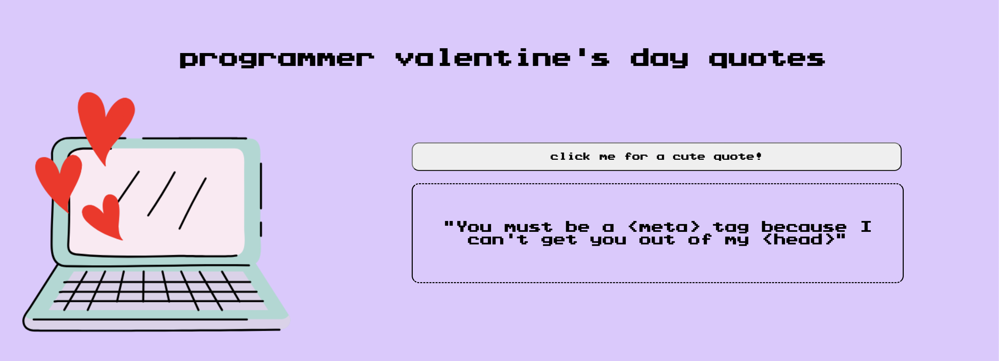
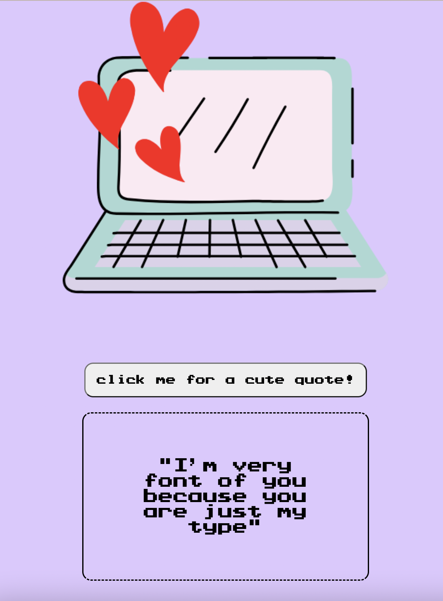
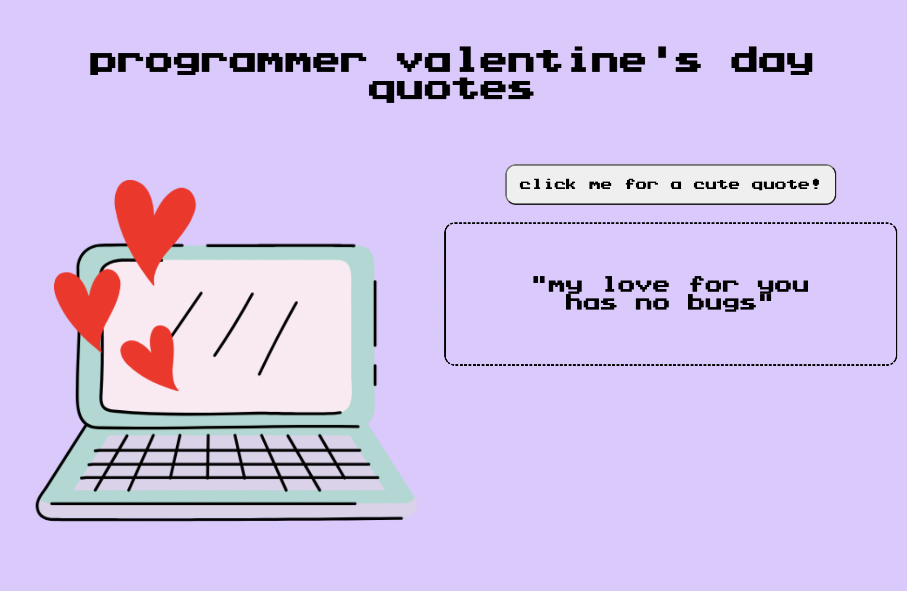
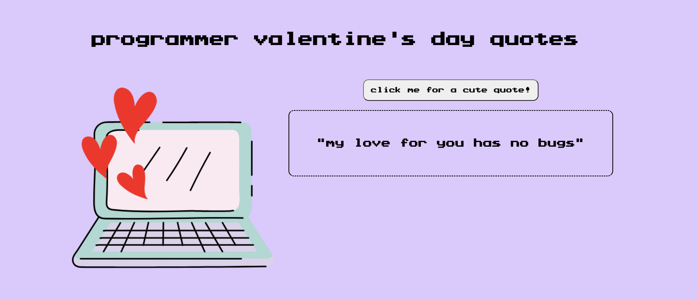

# QuoteGenerator

## Victories
- downloaded custom font
- made custom image
- made responsive for all browsers sizes!
- changed CSS grid into CSS flexbox, removed many lines of unnecessary code

## Challenges
- Getting to learn CSS flex more

